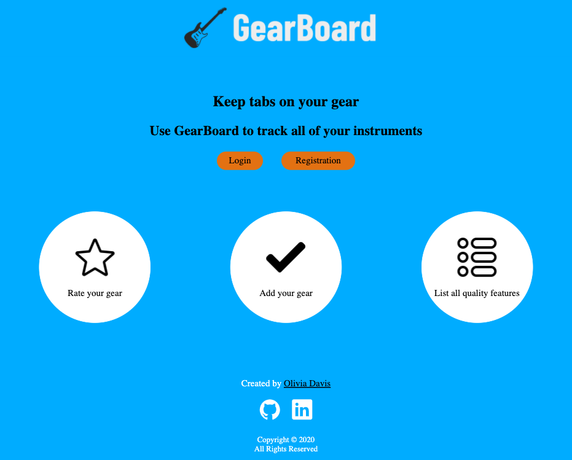
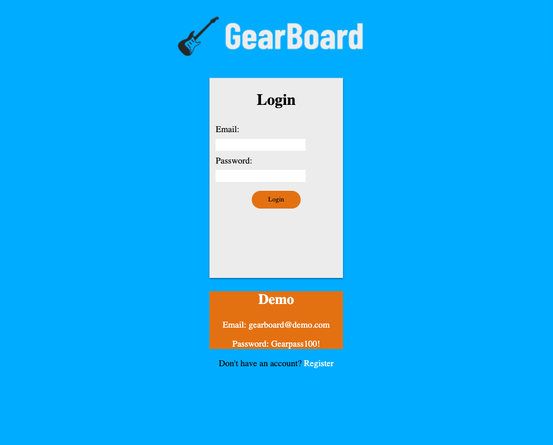
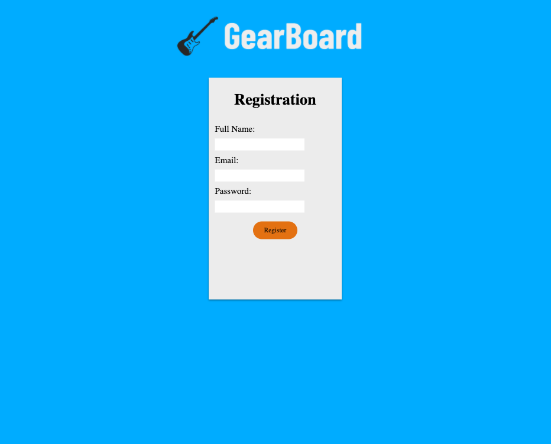
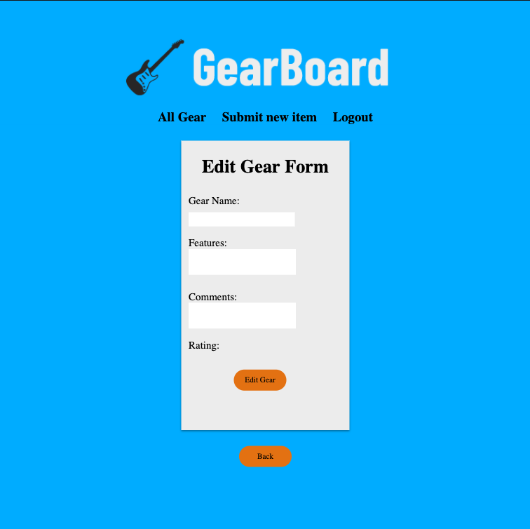
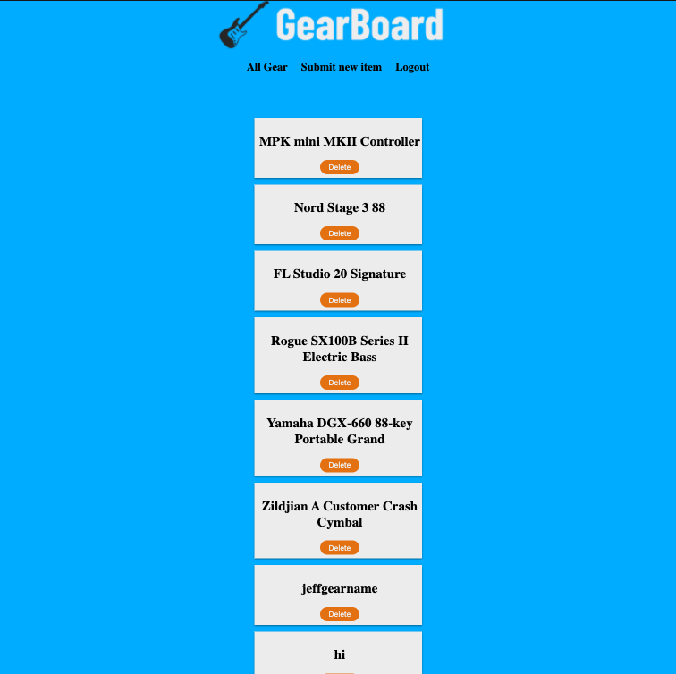
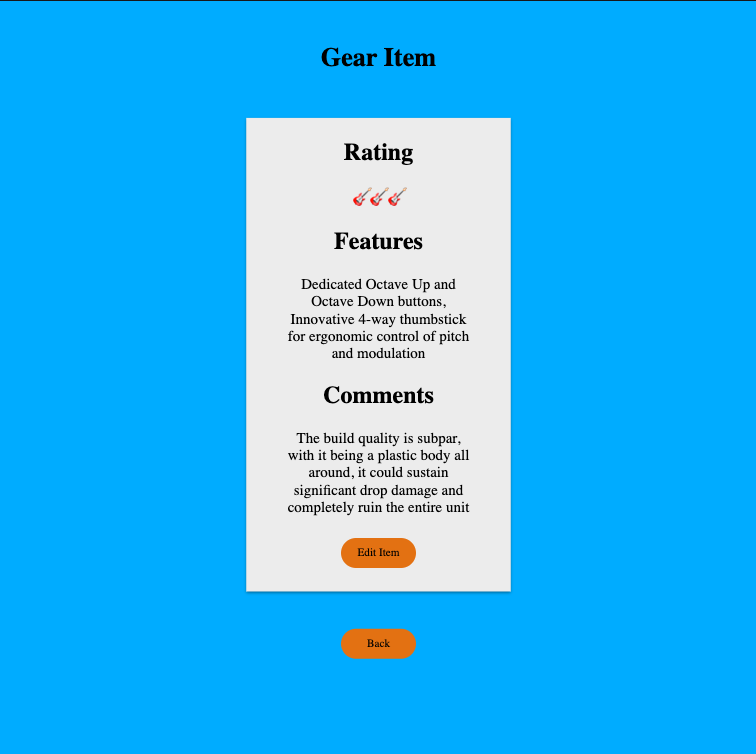
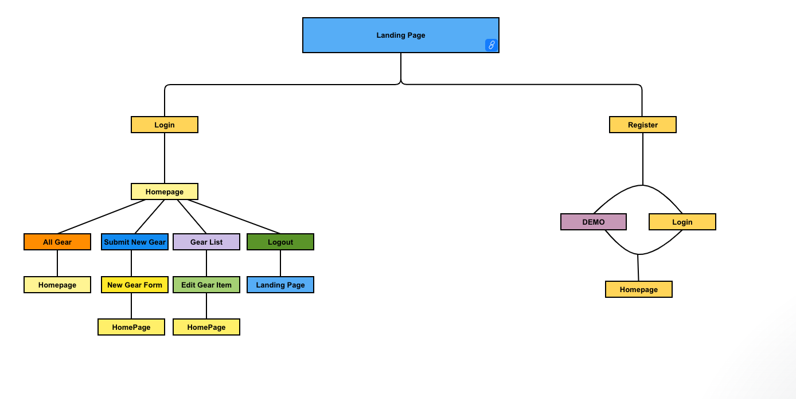

# GearBoard :guitar:

- [GearBoard](https://gearboard-app.now.sh/) is a full-stack React application designed to help music lovers keep track of their gear! It provides a responsive, intuitive experience for users to add gear and track all of their instruments. The Back-End repo can be found [here](https://github.com/oliviadavis593/gearboard-api)

# Screenshots 📸
|  |
|:---:|
|Landing|

|  |  | 
|:---:|:---:|:---:|
|Login|Registration|Edit Form|

|  |  |
|:---:|:---:|
|Homepage|Item Page|

# User Flow
- This is the original component composition intended for the application 
 

# Tech Used 🖥

**Front-End**
- HTML5
- CSS3 
- [React](https://reactjs.org/) (Javscript Framework)

**Back-End**
- [Node](https://nodejs.org/en/)
- [Express](https://expressjs.com/)
- [PostgreSQL](https://www.postgresql.org/) (Relational Database Management System)
- [Bcrypt](https://www.npmjs.com/package/bcrypt) (Password Hashing)
- [JSON Web Tokens](https://jwt.io/) (Authentication)

**Testing and Deployment**
- [Jest](https://jestjs.io/) (Front-End Framework Testing)
- [Enzyme](https://github.com/enzymejs/enzyme) (Front-End Framework Testing)
- [Mocha](https://mochajs.org/) (Back-End Framework Testing)
- [Chai](https://www.chaijs.com/) (Assertion Library For Node)
- [Heroku](https://www.heroku.com/platform) (Cloud PaaS)
